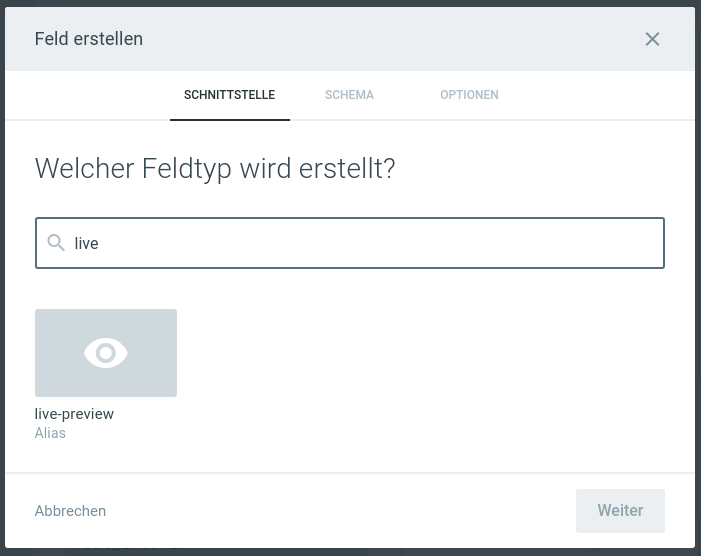
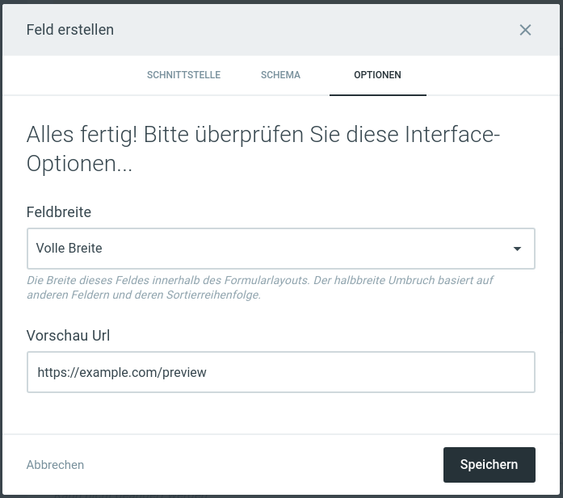
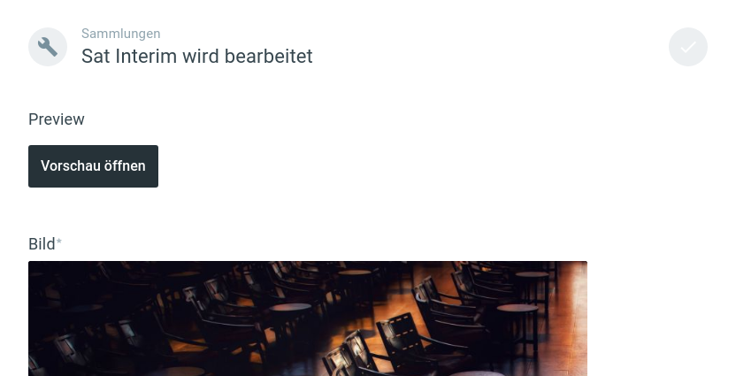

# live-preview

## How does this work?

You are now able to add a live-preview interface to your directus collections.



In there you can specify a preview url.



Now, back on your collection item, you should be able to see the following button:



Pressing this button, will open the url you specified before in a new tab. You can now consume the current item data with the following snippet:

```typescript
// create a message handler
const handler = (event: MessageEvent) => {
  // typescript only, check if event source is a Window instance
  const isWindow = !(event.source instanceof MessagePort) && !(event.source instanceof ServiceWorker);
  const source = event.source && isWindow ? (event.source as Window) : null;

  if (!source) return;

  // receive ping from the directus interface
  if (event.data === 'ping') {
    // and answer with pong, to say, you are alive
    (event.source as Window)?.postMessage('pong', event.origin);
    return;
  }

  // do something with event.data

  // you got the data, remove the listener now
  window.removeEventListener('message', handler);
};

// listen for messages from the parent frame
window.addEventListener('message', handler, false);
```